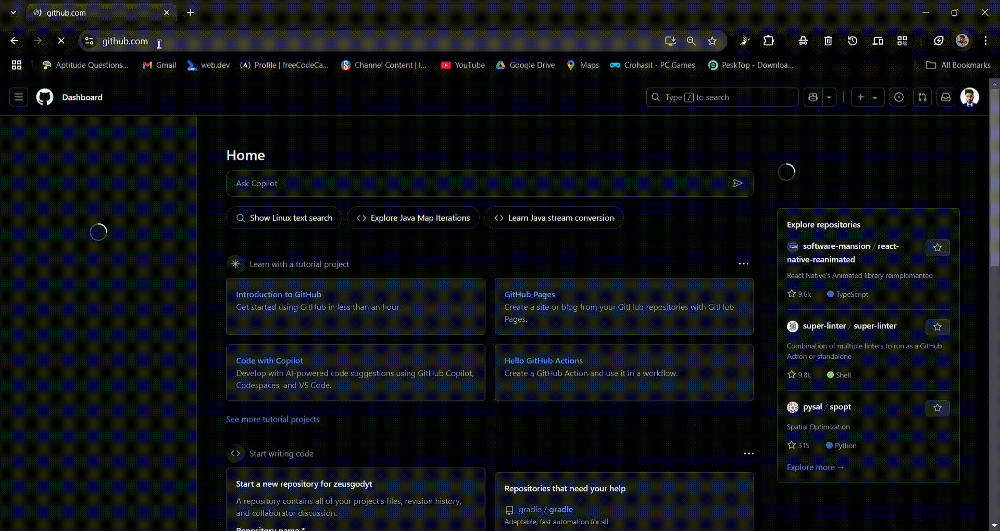

<p align="center">
  <a href="#" target="_blank">
    
  </a>
</p>

<h1 align="center">🎭 PACO - Package Confuser</h1>

<p align="center">
🕵️‍♂️ Chrome Extension to uncover unpublished, removed, or broken packages in GitHub repositories across major ecosystems.
</p>

<p align="center">
  <a href="https://www.producthunt.com/posts/paco-package-confuser?embed=true&utm_source=badge-featured&utm_medium=badge&utm_souce=badge-paco&#0045;package&#0045;confuser" target="_blank"></a>
</p>

---
## Tested By - * **Sidhanta Palei** – [Click to Check Linkedin Proofs](https://www.linkedin.com/posts/sidhanta-palei-58791323b_cybersecurity-opensource-browserextensions-activity-7326265250578616320-COb6?utm_source=share&utm_medium=member_android&rcm=ACoAAD8AocQBpSRpmmF7i9dBqZX3NcBEI7W-3gI)


## 📽️ Live Demo

<p align="center">
  
</p>


---

## 🚀 What is PACO?

**PACO (Package Confuser)** is a lightweight Chrome extension designed to help developers and security researchers uncover potential dependency confusion issues by scanning public GitHub repositories. It detects packages that are:

* 🔴 **Unpublished**
* ⚠️ **Removed**
* ❌ **Nonexistent** on public registries

With a simple click, PACO parses project files like `package.json`, `requirements.txt`, `pom.xml`, and more, checking each dependency against the official package registries in real-time.

---

## ❓ What is Dependency Confusion?

**Dependency Confusion**, also known as **Substitution Attack**, is a software supply-chain vulnerability where an attacker registers a malicious package on a public registry using the **same name as a private/internal dependency** used within an organization. If a build system prioritizes public packages over internal ones, it may inadvertently pull the attacker’s malicious package instead of the intended internal version.

### 🔥 Real-World Example

In 2021, security researcher Alex Birsan exploited this issue across major tech companies (Apple, Microsoft, PayPal, etc.) by uploading intentionally named packages to public registries like npm, PyPI, and RubyGems—triggering automatic installs in their internal pipelines.

> This vulnerability can lead to **remote code execution**, **data exfiltration**, and **supply-chain compromise** if not mitigated properly.

**PACO** helps identify packages in public repos that:

* May not exist on public registries (hinting at private/internal use)
* Were published but later removed (possible signs of abuse)
* Could be exploited for name squatting or dependency hijacking

---

## 🎯 Why Use PACO?

### 🔐 **Security Auditing**

Unpublished or removed dependencies are often indicators of supply-chain attacks. PACO helps you identify such threats effortlessly.

### 🧑‍💻 **Open-Source Project Review**

Before forking or using any public repository, ensure its dependencies are valid and actively maintained.

### ⚙️ **DevOps & QA**

Detect broken or missing packages early, avoiding CI/CD failures and deployment issues.

### 🕵️‍♀️ **Recruitment / Code Review**

Analyze package hygiene in coding assessments or open-source contributions during hiring processes.

### 📈 **Tech Due Diligence**

Assess codebases during M\&A or internal audits for third-party dependency risks.


## 🔍 Supported Ecosystems

| Ecosystem   | Files Scanned                       | Registry Checked                              |
| ----------- | ----------------------------------- | --------------------------------------------- |
| **Node.js** | `package.json`, `package-lock.json` | [npmjs.org](https://registry.npmjs.org/)      |
| **Python**  | `requirements.txt`, `setup.py`      | [pypi.org](https://pypi.org/)                 |
| **Ruby**    | `Gemfile`, `Gemfile.lock`           | [rubygems.org](https://rubygems.org/)         |
| **Java**    | `pom.xml`                           | [search.maven.org](https://search.maven.org/) |

> *More ecosystems coming soon (e.g., Go Modules, Cargo, NuGet)!*

---

## 🧠 How It Works

1. **Parse Files**: Scans GitHub pages for package files or links to raw files.
2. **Extract Dependencies**: Uses regular expressions to parse known formats.
3. **Check Registries**: Validates each dependency name against its respective registry.
4. **Classify Status**:

   * ✅ **Found** – Safe
   * ❌ **Not Found** – Possibly typo, removed, or never published
   * 🔴 **Unpublished** – Removed from the registry
5. **Show Results**: Displays scan results in the extension popup, with filters and download support.

---

## 🛠 Tech Stack

| Layer             | Tech Used                                |
| ----------------- | ---------------------------------------- |
| **Platform**      | Chrome Extension (Manifest V3)           |
| **Frontend**      | HTML, CSS, Vanilla JavaScript            |
| **Backend Logic** | Fetch API, async/await, RegEx            |
| **Concurrency**   | Custom batch queue with smart throttling |
| **Messaging**     | Chrome runtime message passing           |

---
## 💡 Key Features

- ✅ **Deep GitHub Search Integration**
  - Works not only on open repos, but also GitHub search result pages
- ✅ **Multi-Ecosystem Support**
  - Scans NPM, PyPI, RubyGems, Maven packages
- ⚡ **Blazing Fast Queue Processing**
  - Handles 100+ concurrent requests with smart throttling
- 📊 **Live Scan Progress**
  - Animated progress bar with live updates
- 💥 **Instant Results**
  - Packages flagged as `Not Found`, `Unpublished`, or safe
- 🧼 **No External Dependencies**
  - Lightweight, clean, and framework-free JavaScript
- 💻 **Developer-Friendly UX**
  - Checkbox toggles, scrollable results, one-click scan
- 🔐 **Zero Tracking**
  - All data stays in your browser. No accounts, no data collection.

---

## 📦 Installation Guide

1. **Clone or download this repo**
2. Go to `chrome://extensions/`
3. Enable **Developer Mode**
4. Click **Load unpacked** and select the repo folder
5. Navigate to any GitHub repo or search results page
6. Click the PACO icon → Press **“Start Scan”**

---

## 🗂 Project Structure

```
paco/
├── background.js      # Handles fetch requests and queues
├── content.js         # Scans GitHub pages for package links
├── manifest.json      # Chrome extension config (Manifest V3)
├── popup.html         # Extension popup UI
├── popup.js           # Popup logic and messaging
├── style.css          # UI styling
├── icons/             # Icon assets (128x128, etc.)
```

---

## 👨‍💻 Authors

* **Anurag Kumar** – [@zeusgodyt](https://github.com/zeusgodyt)
* **Sidhanta Palei** – [@r00tSid](https://github.com/r00tSid)

---

## 📘 Attribution

* GitHub logo used under fair use ([GitHub Brand Guidelines](https://github.com/logos)).
* This extension is **not affiliated with or endorsed by GitHub**.

---
